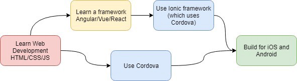
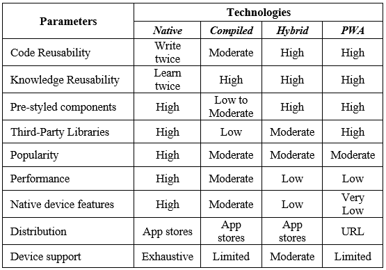

# Choosing the Right Mobile App

## Native app

- Learn **Java**/**Kotlin** -> Download Android Studio -> Write code -> Build&Deploy
- Learn **Objective C**/**Swift** -> Find a Mac for Xcode -> Write code -> Build&Deploy

## Hybrid app

- [Cordova](https://cordova.apache.org/)
- [Ionic](https://ionicframework.com/)

## Native compiled app

- [React Native](https://facebook.github.io/react-native/)
- [NativeScript](https://www.nativescript.org/)
- [Flutter](https://flutter.dev/) (better)

## Progressive web app (PWA)

1. Service Worker
2. The manifest file
3. HTTPS

> [Demo](https://www.fidgetspin.xyz/)

## Comparison

## Conclusion

Looking at the above table, we can summarize in a few points:

- Choose Native if performance and access to device hardware features are important.
- Choose PWA if you are making an e-commerce website+app.
- Choose Compiled or Hybrid if you and your team are comfortable with web technologies and want to build apps in a limited time.
- Flutter looks very promising with easy styling, great performance, and Google’s backing.
- PWA has the highest reach with companies like Flipkart, Twitter Lite and Starbucks reporting increased user retention rate.
